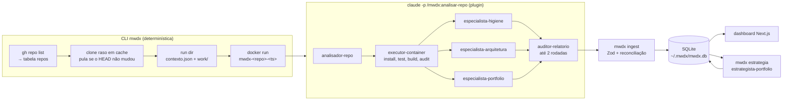

# Arquitetura e decisões

## Fluxo de uma análise (`mwdx scan <repo>`)

1. **CLI.** Sincroniza os metadados com `gh`, clona com `--depth 1` em `~/.mwdx/cache/<repo>` e pula o repo se o HEAD não mudou desde a última análise (a não ser com `--force`). Monta o run dir `~/.mwdx/runs/<repo>/<ts>/` com uma cópia do código em `work/`, detecta a stack e sobe um container descartável com o `work/` montado. As imagens por stack são `node:22`, `mcr.microsoft.com/dotnet/sdk:8.0`, `maven:3-eclipse-temurin-21` e `python:3.12`.
2. **Plugin.** O `claude -p` roda no host. O `executor-container` descobre como instalar, testar, buildar e auditar o projeto (sempre via `docker exec`) e grava `execucao.json`. Os três especialistas leem o código, esse arquivo, o `contexto.json` (achados anteriores e ignorados) e o `perfil.md`, e gravam `<dimensao>.json` com a nota, a reconciliação dos achados antigos e os achados novos. O `auditor-relatorio` reprova achados sem evidência verificável ou com ação vaga.
3. **Ingest.** Valida tudo com Zod, dá ids estáveis `<repo>-<dimensao>-<n>` aos achados novos, aplica a reconciliação (`resolvido`, `persistente`, `regrediu`) e registra cada transição em `achado_eventos`. O container é removido em `finally`, inclusive quando algo falha.

A **visão transversal** (`mwdx estrategia`) monta `resumo.json` com todos os repos, notas e achados. O `estrategista-portfolio` devolve padrões entre repos, os repos a fixar e a arquivar, e a reconciliação dos achados transversais anteriores.

## Modelo de dados

`repos` · `runs` (status, custo, duração, erro) · `notas` (por run e dimensão) · `achados` (evidências, impacto e esforço de 1 a 3, ação, status) · `achado_eventos` (de → para, origem agente/usuário, motivo) · `recomendacoes` (fixar/arquivar por run transversal). O esquema está em [`packages/db/src/tabelas.ts`](../packages/db/src/tabelas.ts), com migrações versionadas em `packages/db/drizzle/`.

## Decisões

| Decisão | Por quê | Custo |
|---|---|---|
| **Zod como fonte única**, gerando os JSON Schemas do plugin | O ingest, o hook e os agentes usam o mesmo contrato, então a saída do LLM não diverge do banco. | Um passo de geração (`pnpm schemas`). O CI falha se os arquivos gerados ficarem desatualizados. |
| **Hooks validam cada JSON gravado** pelos agentes | O agente recebe o erro de schema na hora e corrige na mesma sessão, em vez de o erro só aparecer no ingest. | O hook roda a cada `Write`. Validações entre arquivos (ex.: um repo inexistente no transversal) ficam no script do hook. |
| **Reconciliação por id de achado** | Cada run diz o que aconteceu com os achados anteriores. Dá para ver a evolução, e um achado ignorado não volta com outro nome. | Os especialistas precisam ler e responder a todos os achados ativos, o que aumenta o contexto a cada run. |
| **Run dir autocontido** | Os agentes só recebem um caminho, e as ferramentas de escrita ficam restritas a ele. Qualquer run pode ser inspecionado ou reingerido depois. | Copia o código a cada análise. O `work/` é limpo com `git clean -ffdx` depois do ingest. |
| **Execução em container, com o claude no host** | Os testes e o `npm audit` rodam de verdade, sem executar código de terceiros na máquina. O agente só consegue `docker exec` em containers `mwdx-*`. | Imagem fixa por stack: runtimes antigos dependem de roll-forward. Testes e2e que precisam de servidor ou browser ficam como `parcial`. |
| **`--setting-sources project --strict-mcp-config`** | O `claude -p` carrega só o plugin mwdx, sem plugins, MCPs e hooks globais de quem roda. Assim o resultado fica reproduzível. | Qualquer ferramenta extra precisa ser declarada no próprio plugin. |
| **O auditor é o único validador de qualidade** | Mantém o custo por repo previsível. O motivo de cada "ignorar" fica gravado e pode virar a base de um eval. | Sem eval automatizado, a qualidade dos insights depende da revisão humana no dashboard. |
| **SQLite local, sem servidor** | É uma ferramenta de uma pessoa só, e o banco é um arquivo que a CLI e o dashboard compartilham. | Sem multiusuário. O dashboard só escuta em localhost e não tem autenticação. |

## Limitações conhecidas

- **Custo:** cerca de US$ 1,50–4 equivalentes por repo (3–8 min) no limite da assinatura do Claude. O `scan --all` para sozinho quando o limite é atingido e pode ser retomado depois.
- **Notas oscilam** alguns pontos entre runs sem mudança no código. O dashboard só mostra a seta de variação a partir de 10 pontos.
- A primeira stack reconhecida vence. Monorepos com várias stacks são executados só na principal.
